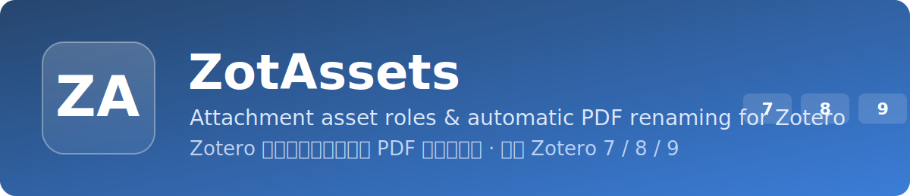

<div align="center">



# ZotAssets

**English** · [简体中文](README.zh-CN.md)

**A Zotero plugin that gives every attachment an asset role — Main PDF, Supplement, Data, Code, Figure, Translation, Scan, Publisher version, Accepted manuscript, Preprint — auto-detects Main PDFs and Supplements from the PDF's content, and auto-renames PDFs from a template.**

[Latest release](https://github.com/Lyz-623/ZotAssets/releases/latest) · [Changelog](CHANGELOG.md) · [Support](#support)

Compatible with **Zotero 7 / 8 / 9** · Bootstrapped plugin (no overlay)

</div>

---

## What it does

In a large Zotero library every item ends up with several attachments — the main
PDF, supplements, datasets, code, scanned copies — but Zotero treats them all the
same. ZotAssets adds one **primary asset role** to each attachment, shows it in
the UI, and (for PDFs) renames the file consistently so you can tell them apart at
a glance. It can do this for one item, a selection, or the entire library.

## Highlights

| Feature | Details |
|---|---|
| Asset roles | 11 built-in roles, one primary role per attachment. |
| Content-based auto-detect | Reads the PDF's **first-page text** to detect **only** Main PDF and Supplement (see below). Everything else is left untouched for manual assignment. |
| Preview first | Library/selection runs show per-role counts, a "left unchanged" count and example renames, and require confirmation before anything changes. |
| Progress bar | Scanning and applying show a determinate progress bar, not a frozen window. |
| PDF auto-rename | Rename PDFs from a safe, cross-platform template; titles stay in sync. |
| Non-destructive | Roles are stored separately; attachment path, notes and tags are never touched. |
| Reversible | The original file name is captured before the first rename; Clear role can restore it. |
| Batch + summary | Single or batch operations report succeeded / skipped / failed. |
| EN / 中文 | Menus, dialogs, previews and summaries in English or Simplified Chinese. |

## How auto-detection works

Detection is **content-based** — it reads the first page of each PDF (via Zotero's
PDF text engine) rather than guessing from the file name:

- **Supplement** — the first page contains an explicit supplementary marker, e.g.
  *Supplementary Information*, *Supporting Information*, *Supplementary Material*,
  *Supplement*, an *SI &lt;heading&gt;* reference, or the Chinese *补充材料/信息*.
- **Main PDF** — the first page contains **both a DOI and the parent item's journal
  name** (`publicationTitle` / `journalAbbreviation`).

Any PDF that doesn't clearly meet one of these (and every non-PDF) is **left
unchanged** so you can assign a role manually. All 11 roles remain available from
the menu and the Edit role dialog.

> Tip: Main PDF detection needs the parent item to have a journal title in its
> metadata. Items without journal metadata (books, theses, etc.) are left for
> manual assignment.

## Asset roles

| Role | Tag (in file name) |
|---|---|
| Main PDF | `Main` |
| Supplementary material | `Supplement` |
| Data | `Data` |
| Code | `Code` |
| Figure / table | `Figure` |
| Translation | `Translation` |
| Scan | `Scan` |
| Publisher version | `Published` |
| Accepted manuscript | `AcceptedMS` |
| Preprint | `Preprint` |
| Other | `Other` |

## Install

1. Download `ZotAssets-<version>.xpi` from [Releases](https://github.com/Lyz-623/ZotAssets/releases/latest).
2. Open Zotero → **Tools → Plugins**.
3. Click the gear icon → **Install Plugin From File…**.
4. Select the `.xpi`, then restart Zotero if prompted.

Requirements: Zotero 7 or later. If your browser opens the `.xpi` directly,
right-click the release asset and choose "Save link as…". Once installed,
ZotAssets **auto-updates** from GitHub Releases.

## Usage

Right-click any item or attachment to open the **ZotAssets** submenu.

**Automatic:**

1. **Auto-classify selected items…** — classify the attachments of the selected items.
2. **Auto-classify entire library…** — scan everything.
3. A progress bar shows the scan; only Main PDF and Supplement are auto-detected.
4. A **preview** shows per-role counts, how many are left unchanged, and example
   `old → new` renames.
5. Confirm to proceed, then choose **rename PDFs** or **roles only**.
6. A progress bar runs and a summary reports succeeded / skipped / failed.

**Manual:**

- **Edit role…** — pick a role for a single attachment (shows the current role).
- **Set role ▸** — quick-set a role for one or many attachments.
- **Clear role** — remove the role; you'll be asked whether to also restore
  original file names.
- **Rename by role** — re-apply the template using the stored role.

## PDF renaming

When a **PDF** attachment gets or changes a role, its file is renamed using the
template (default):

```
{firstAuthorLastName}_{year}_{parentTitle}_{role}.pdf
```

Examples:

```
Smith_2021_Deep Learning for Citation Analysis_Main.pdf
Smith_2021_Deep Learning for Citation Analysis_Supplement.pdf
Smith_2021_Deep Learning for Citation Analysis_AcceptedMS.pdf
```

Rules:

- Only **PDFs** are renamed; non-PDF attachments only get the role saved.
- Author surname, year, parent title and role tag are all made file-name safe on
  Windows/macOS/Linux.
- Missing author/year/title fall back to `Unknown` / `0000` / `Untitled`.
- Target name collisions get a suffix: `__2`, `__3`, …
- The attachment title is kept in sync with the file name.
- The original file name is captured once before the first rename for rollback.
- Linked files are not renamed unless explicitly enabled.
- Missing/locked files and parent-less attachments are handled safely and reported.

## Settings

Settings live under the `extensions.zotassets.` branch. Until a dedicated pane is
added, edit them in **Settings → Advanced → Config Editor**.

| Key (after `extensions.zotassets.`) | Default | Meaning |
|---|---|---|
| `autoRenamePdf` | `true` | Auto-rename PDFs on role change |
| `renameLinkedFiles` | `false` | Allow renaming linked files |
| `showRoleInTitle` | `true` | Show the role tag in the attachment title |
| `filenameTemplate` | `{firstAuthorLastName}_{year}_{parentTitle}_{role}.pdf` | PDF file-name template |
| `language` | `auto` | `auto` \| `en` \| `zh` |
| `useCustomDialog` | `false` | Use the XHTML dialog instead of the native picker |
| `roleData` | `{}` | Internal role storage (do not edit) |

### Changing the naming template

Edit `filenameTemplate`. Placeholders: `{firstAuthorLastName}` · `{year}` ·
`{parentTitle}` · `{role}`. A single `.pdf` extension is always enforced.

### Changing the role list / detection

Roles are defined in
[`addon/content/modules/roles.js`](addon/content/modules/roles.js). Content-based
detection rules (supplement markers, DOI pattern, journal-name matching) live in
[`addon/content/modules/classifier.js`](addon/content/modules/classifier.js).

### UI language

All UI strings are in
[`addon/content/modules/strings.js`](addon/content/modules/strings.js) (`en` / `zh`).

## Build

PowerShell (no Node.js required):

```powershell
powershell -ExecutionPolicy Bypass -File scripts\build.ps1
```

Node.js (cross-platform):

```bash
npm run build
```

The packaged plugin is created at `dist/ZotAssets-<version>.xpi`. An `.xpi` is
just a ZIP with `manifest.json` at the root (built with forward-slash entries so
Zotero's zip reader can load it).

## Development & debugging

This is a bootstrapped plugin, so you can run it from source:

1. In `<Zotero profile>/extensions/`, create a file named `zotassets@yunze.dev`.
2. Its only content is the absolute path to this repo's `addon` folder.
3. Start Zotero with `zotero -purgecaches -ZoteroDebug -jsconsole`.
4. Logs are prefixed `[ZotAssets]` in the Error Console / Debug Output.

## Project layout

```
addon/
  manifest.json            WebExtension manifest (Zotero 7+)
  bootstrap.js             Thin lifecycle entry
  content/
    zotassets.js           Orchestrator: loads modules, manages windows
    roleDialog.xhtml/js     Optional XHTML role dialog
    modules/
      compat.js            Zotero 7/8/9 + platform API layer (incl. PDF text)
      classifier.js        Content-based role detection (first-page text)
      autoClassify.js      Library/selection scan + preview + apply (+progress)
      roleManager.js       set/clear/rename + batch orchestration
      rename.js            PDF rename + restore-original engine
      filename.js          File-name sanitization + template
      roleStore.js         Per-item role + original-name persistence
      roles.js  strings.js  prefs.js  dialog.js  menu.js  ui.js  log.js
scripts/
  build.ps1  build.js       .xpi packaging
```

## Adapting to future Zotero versions

All version-sensitive behavior is funneled through
[`compat.js`](addon/content/modules/compat.js): version detection, file system
(`IOUtils`/`PathUtils` → `OS.File`/`OS.Path` → `nsIFile`), PDF text extraction
(`PDFWorker` → indexed `attachmentText`), and attachment API wrappers.
`manifest.json` declares `strict_max_version` `9.*`; to support a future Zotero,
bump that and add any new fallbacks in `compat.js` only.

## Safety & recovery

- Library-wide auto-classify is **preview-gated** and asks twice before renaming.
- Role data is stored separately from Zotero's fields — clearing a role or
  uninstalling never deletes your files.
- The original file name is recorded before the first rename and can be restored.
- No single failing operation can crash Zotero or the plugin.

## Version notes

- `0.3.0`: content-based detection (reads the PDF first page) — Supplement from
  explicit markers, Main PDF from DOI + journal name; determinate progress bars
  for scan and apply; README split into separate English / Chinese files.
- `0.2.1`: restricted auto-detection to Main PDF + Supplement; Main tag.
- `0.2.0`: automatic role classification (selection + whole library), preview-first.
- `0.1.0`: initial prototype — roles, persistence, context menu, role dialog,
  template-based PDF renaming.

See [CHANGELOG.md](CHANGELOG.md) for details.

## Support

ZotAssets is free and open source. If it saves you time, a GitHub star or a small
tip helps keep the updates coming.

| PayPal | WeChat Pay | Alipay |
|:---:|:---:|:---:|
|  |  |  |

## License

MIT — see [LICENSE](LICENSE).
